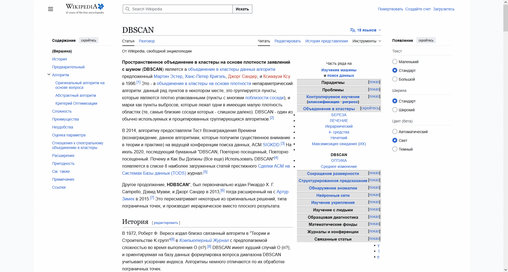
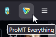

# ProMT Everything

A browser extension that brings ProMT-powered translations to any web page! Supports English → Russian and Russian → English translations.

If you had serious intentions when installing this extension, keep in mind the translations are *intentionally* wonky as hell. Use Google Translate instead, if you wish to understand what's being translated!

## Usage

Open the translation popup by clicking the extension's button in your hotbar. Adjust translation options by toggling the desired checkmarks, then press "translate". Enjoy!

## Building This Yourself

Run `mkmanifest.py firefox` or `mkmanifest.py chrome` to generate a Firefox- or Chrome-compatible `manifest.json` respectively. Then package the necessary files into a ZIP as seen in the [CI workflow source](.github/workflows/publish.yml).
